# Snapseed로 핸드폰 사진 편집하기 – 완벽 가이드 (한글 정리)

> 원문: iPhone Photography School, "Complete Guide To Using Snapseed To Edit Your iPhone Photos" (iphonephotographyschool.com/snapseed/)
> 이 문서는 원문 기사를 그대로 옮긴 것이 아니라, 핵심 내용을 한국어로 재구성·요약한 자료입니다.
> 캡처해 두신 스크린샷 70장(Snapseed1~70)을 각 항목에 맞게 삽입했습니다.

---

## 목차
1. Snapseed에서 이미지 열기
2. 색상·노출·디테일 향상 (Tune Image / White Balance / Details)
3. 개별 편집 수정하기
4. 구도 개선하기 (Crop / Rotate / Perspective)
5. 사진 정리로 완벽한 편집 만들기 (Healing / Portrait)
6. 선택적 편집 도구 활용 (Brush / Selective / Masking / Vignette)
7. 필터로 분위기 바꾸기
8. Looks로 편집 시작하기
9. 편집한 사진 저장하기

---

## 1. Snapseed에서 이미지 열기

Snapseed 앱을 열고 **Open(열기)** 을 탭합니다. 

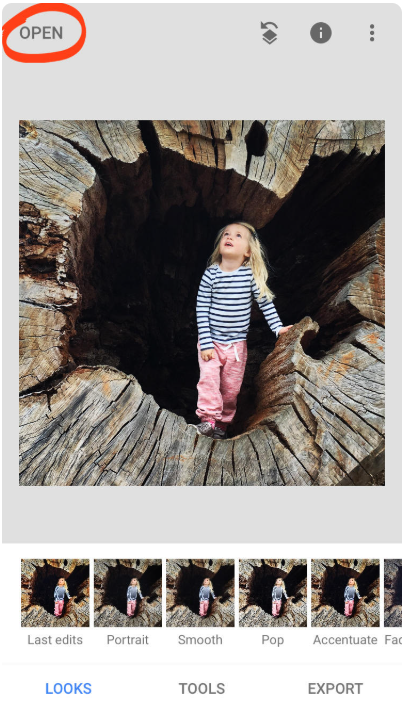

**Open From Device(기기에서 열기)** 를 눌러 핸드폰 사진 라이브러리와 앨범에 접근하거나, 최근 사진 목록을 옆으로 스와이프해 원하는 사진을 선택합니다. 

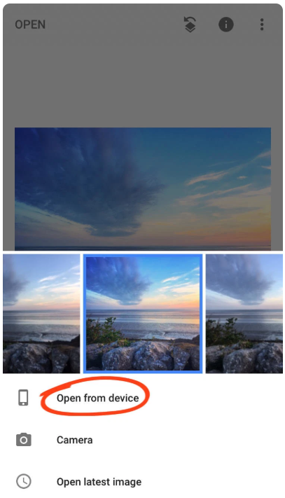

Snapseed에는 두 가지 편집 영역이 있습니다: **Looks(룩)** 와 **Tools(도구)**. 화면 하단에서 두 영역을 전환할 수 있습니다. 

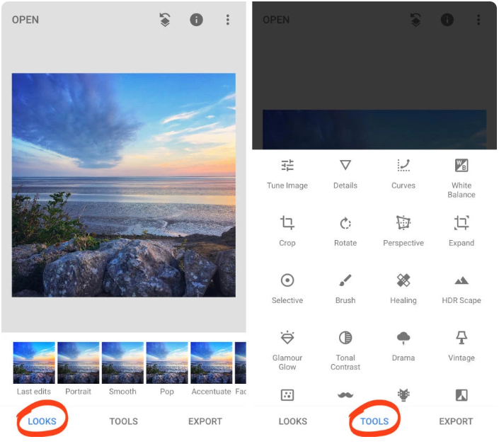

---

## 2. 색상·노출·디테일 향상

사진을 열고 **Tools** 를 탭하면 편집 도구 메뉴가 나타납니다. 

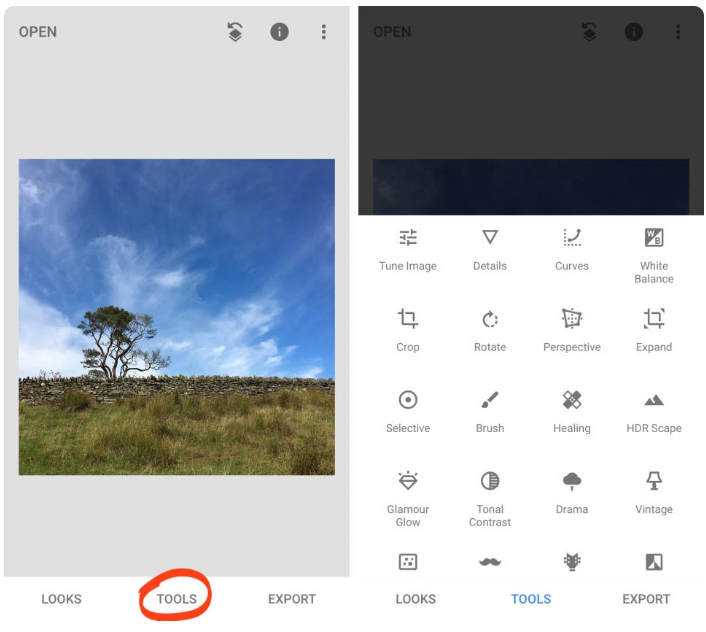

### 2.1 Tune Image (이미지 보정)
색과 노출을 가장 손쉽게 개선할 수 있는, 가장 자주 쓰게 될 도구입니다. 흐릿하고 어두운 사진도 생동감 있게 바꿀 수 있습니다. 

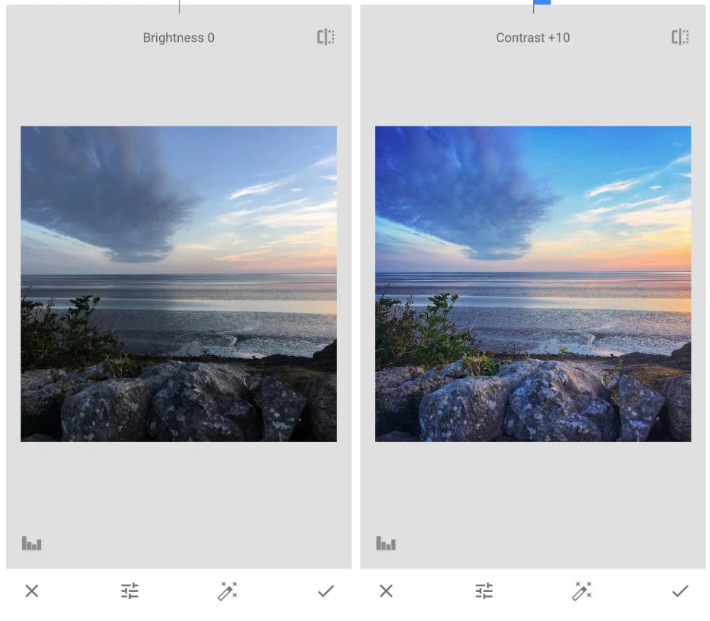

**Tools**에서 **Tune Image**를 탭한 뒤, 사진 위를 위아래로 스와이프해 메뉴를 열고 원하는 세부 도구(밝기, 대비 등)를 선택합니다. 

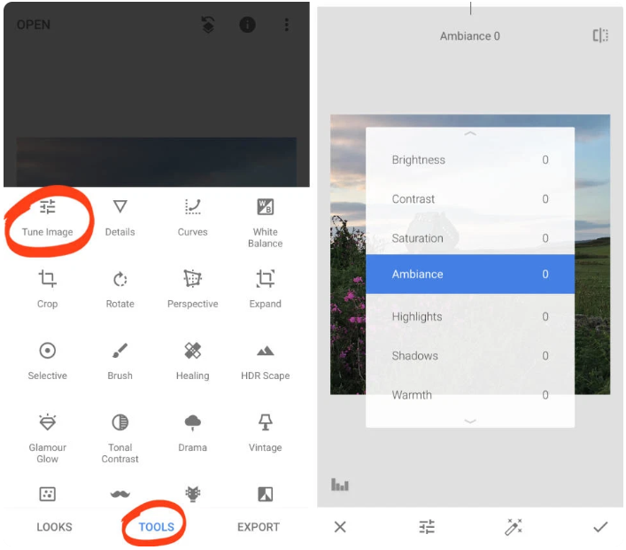

세부 도구별 효과:
- **Brightness(밝기)**: 전체 이미지를 밝거나 어둡게
- **Contrast(대비)**: 밝은 부분과 어두운 부분의 차이 조절
- **Saturation(채도)**: 색상을 더 선명하거나 흐리게
- **Ambiance(분위기)**: 채도와 대비를 동시에 조절
- **Shadows(어두운 영역)**: 그림자 부분만 밝게/어둡게
- **Highlights(밝은 영역)**: 하이라이트 부분만 밝게/어둡게
- **Warmth(색온도)**: 따뜻한 주황색 또는 차가운 청색 톤 추가

도구를 선택한 뒤 사진 위에서 좌우로 스와이프하면 값이 조절되고, 화면 상단에 설정값이 표시됩니다. 

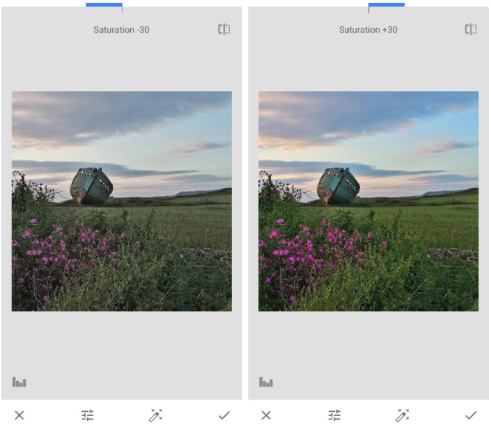

예: **Saturation**으로 색 선명도를 조절하거나, **Warmth**로 색온도를 조절할 수 있습니다. 

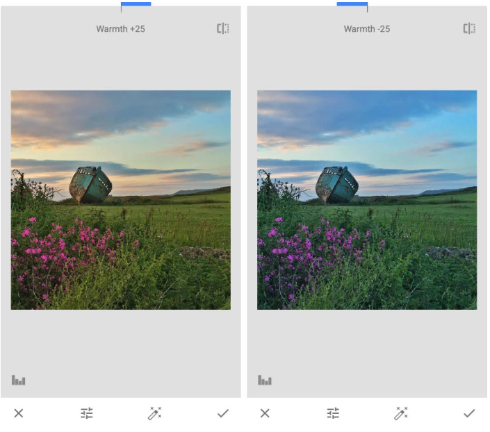

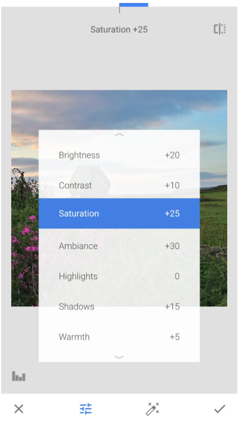

다시 위아래로 스와이프해 다른 도구를 선택하고 반복할 수 있습니다. 

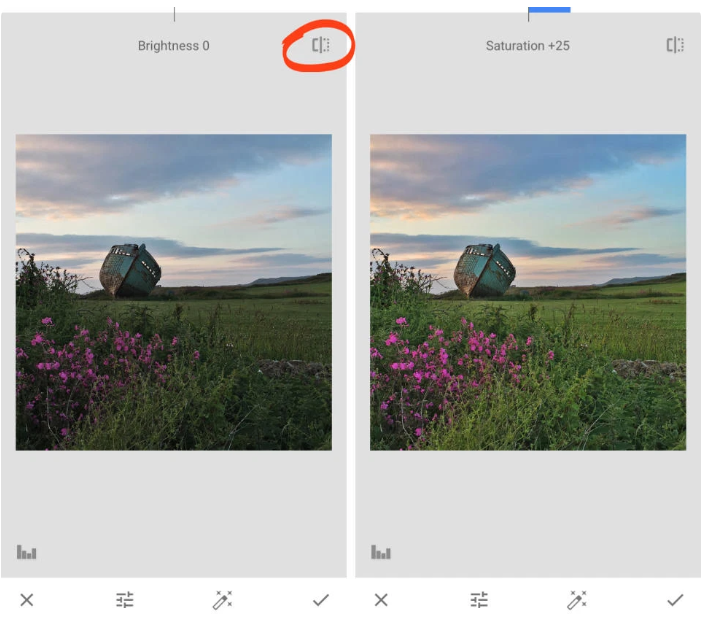

화면 우측 상단 아이콘을 탭&홀드하면 원본과 편집본을 비교할 수 있습니다. 

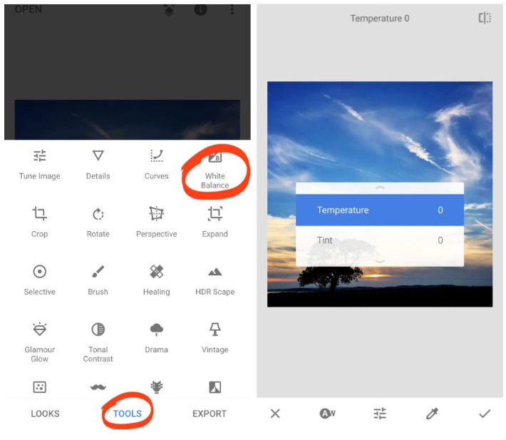

편집이 끝나면 **체크마크**를 탭해 적용합니다.

### 2.2 White Balance (화이트 밸런스)
색조(틴트)를 적용해 색을 보정하거나, 원치 않는 색 캐스트를 수정하거나, 사진의 분위기를 바꿀 수 있는 도구입니다.

**Tools**에서 **White Balance**를 탭하고, 위아래로 스와이프해 메뉴를 엽니다. 

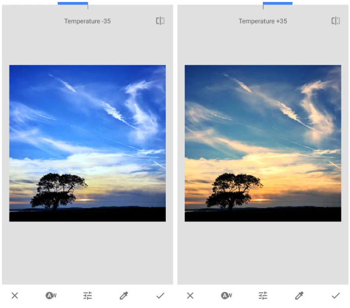

세부 도구:
- **Temperature(색온도)**: 사진을 더 차갑게(블루) 또는 따뜻하게(오렌지)
- **Tint(색조)**: 초록 또는 핑크 색조 추가

좌우 스와이프로 값을 조절합니다. 

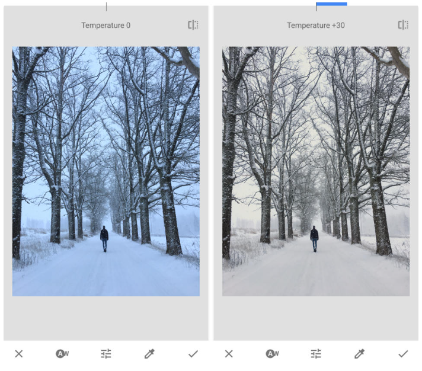

- Temperature를 올려 색을 따뜻하게 하면 일몰 사진에 효과적입니다.
- 흰 눈이 푸르게 나온 사진은 Temperature를 올려 흰색에 가깝게 보정할 수 있습니다. 

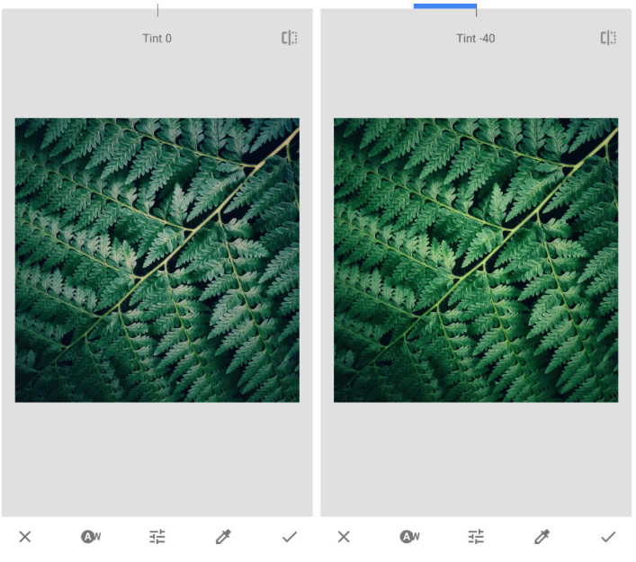
- Tint로 초록빛을 강조하면 나뭇잎·풀 사진에 좋습니다. 

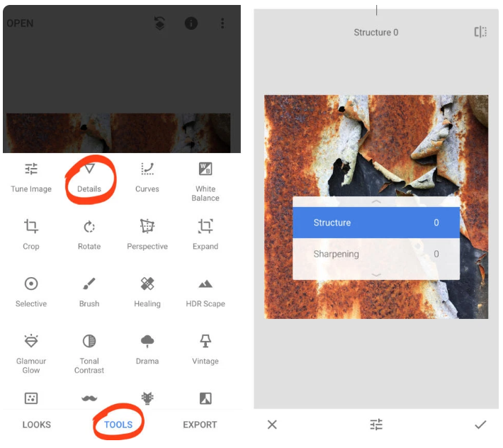

편집 후 **체크마크**로 적용합니다.

### 2.3 Details (디테일)
질감과 세밀한 부분(녹, 나무결, 벗겨진 페인트 등)을 살려주는 도구입니다.

**Tools**에서 **Details**를 탭하고 위아래로 스와이프해 설정을 선택합니다. 

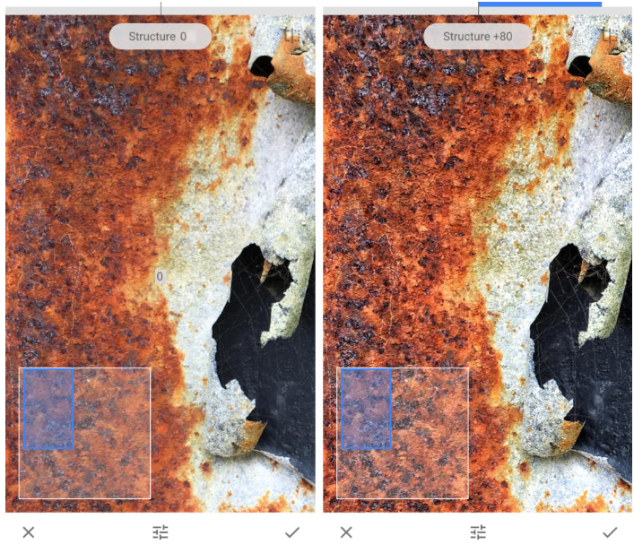

대부분의 경우 **Structure**가 더 좋은 결과를 주며, **Sharpening**은 과도하게 사용하면 노이즈(그레인)를 유발할 수 있어 소량만 사용하는 것이 좋습니다. 

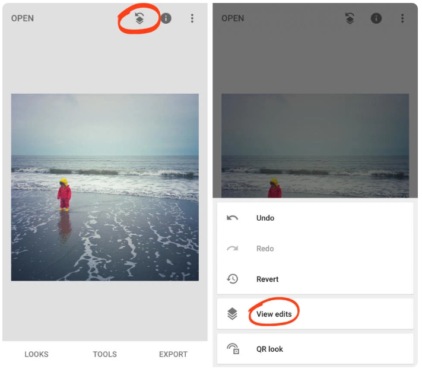

두 손가락으로 화면을 확대해 세부 조정이 화질을 해치지 않는지 확인하세요. 인물 사진에는 이 도구를 강하게 적용하지 않는 것이 좋습니다(피부 질감이 부각되어 부자연스러워질 수 있음).

---

## 3. 개별 편집 수정하기

Snapseed는 "비파괴 편집"을 지원해, 나중에라도 개별 편집을 삭제하거나 수정할 수 있습니다.

편집을 적용한 후 화면 상단의 **Edit History(편집 기록)** 아이콘(곡선 화살표가 있는 사각형)을 탭하고 **View Edits**를 선택합니다. 

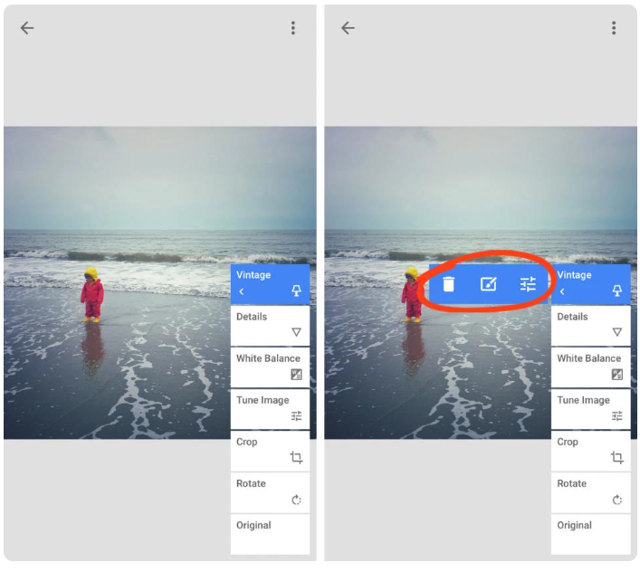

화면 하단에 지금까지 적용한 모든 편집이 스택 형태로 표시되며, 최근 편집이 맨 위에 있습니다. 스택의 편집을 탭하면 세 가지 옵션이 나타납니다. 

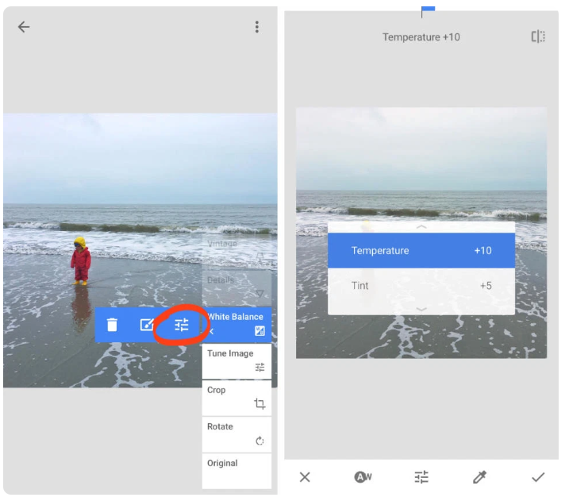

- **Trash(삭제)**: 해당 편집 삭제
- **Sliders(슬라이더)**: 해당 편집의 설정값 재조정
- **Brush(브러시)**: 마스킹 옵션 열기(6장에서 설명)

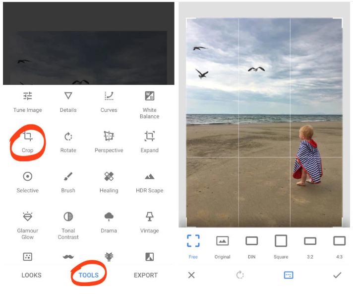

스택에서 특정 편집을 탭하면 그 위의 편집들이 잠시 사라지며, 다시 탭하면 복원됩니다. 편집 기록 화면은 우측 상단 뒤로가기 화살표로 닫습니다.

---

## 4. 구도 개선하기

사진을 열고 **Tools**를 탭합니다.

### 4.1 Crop (자르기)
이미지 가장자리를 잘라내는 도구입니다. 인화 사진의 테두리를 가위로 자르는 것과 비슷합니다. 불필요한 요소나 빈 공간을 제거하고 구도를 개선하는 데 유용합니다.

**Tools**에서 **Crop**을 탭하고, 원하는 비율(Original, Square, 4:3 등)을 선택하거나 자유 비율(Free)을 선택합니다. 

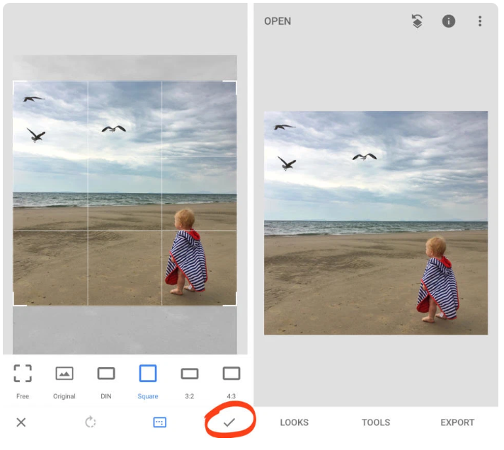

예: Square 비율을 선택하면 하단의 빈 공간이 제거되어 아이와 새에 시선이 집중됩니다. 

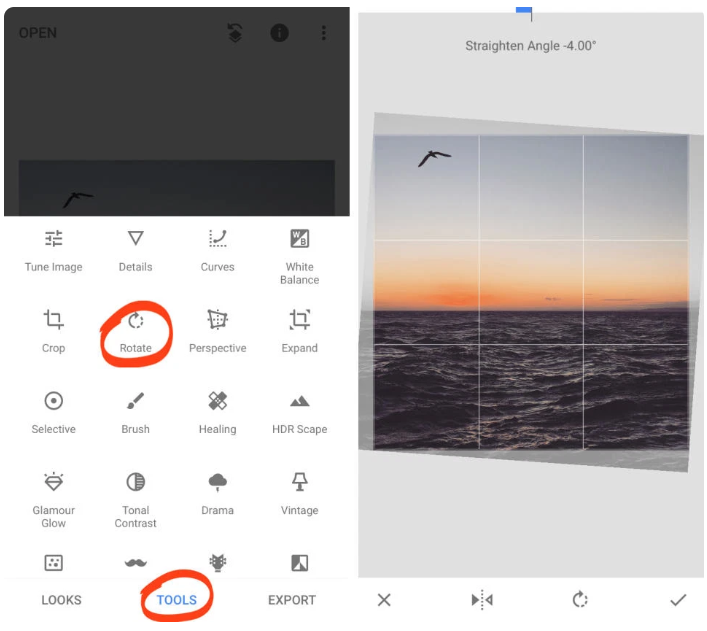

모서리 핸들을 드래그해 자르기 영역을 조정한 뒤 **체크마크**로 완료합니다.

### 4.2 Rotate (회전)
수평이 맞지 않는 사진은 아마추어처럼 보이기 쉽습니다. Rotate 도구로 손쉽게 수평을 맞출 수 있습니다.

**Tools**에서 **Rotate**를 탭하면 Snapseed가 자동으로 분석해 회전·수평을 맞춰줍니다. 

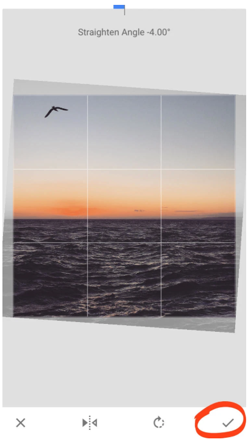

자동 보정이 정확하지 않을 경우, 손가락으로 화면을 드래그해 수동으로 회전할 수 있으며 격자선을 참고하면 편리합니다. 회전 시 이미지 모서리가 잘려나가므로 중요한 요소가 손실되지 않는지 확인 후 **체크마크**로 적용합니다. 

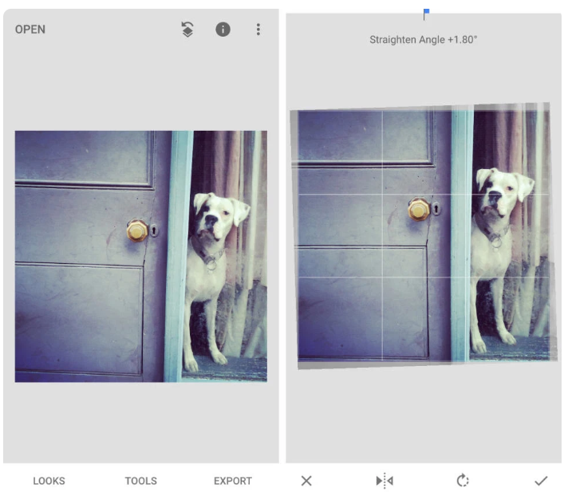

풍경 사진의 수평선을 맞추는 데 특히 유용합니다. 

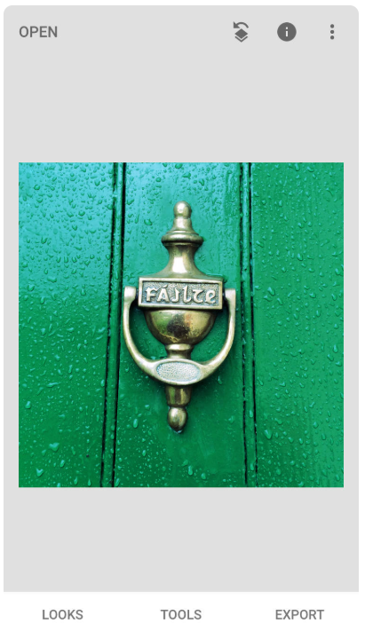

### 4.3 Perspective (원근 왜곡 보정)
원근 문제를 교정하는 도구입니다. 핸드폰을 위로 기울여 높은 건물을 촬영하면 수직선이 위쪽으로 모이며 기울어 보이는데, 이를 보정할 수 있습니다.

예: 문을 약간 위로 기울여 찍어 수직선이 평행하지 않은 사진. 

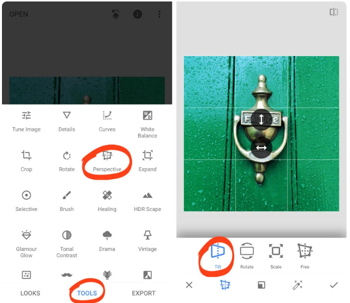

**Tools**에서 **Perspective**를 탭하고 이미지 아래의 **Tilt** 옵션을 선택합니다. 

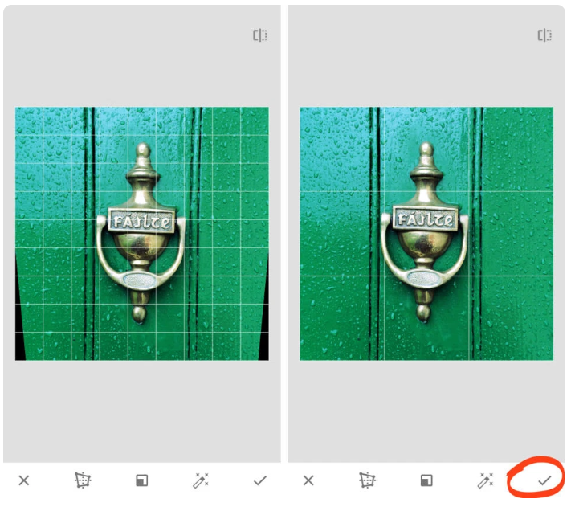

사진 위에서 아래로 드래그하면 수직 원근이 보정되고, 좌우로 드래그하면 수평 원근이 보정됩니다. 완료 후 **체크마크**를 탭합니다. 

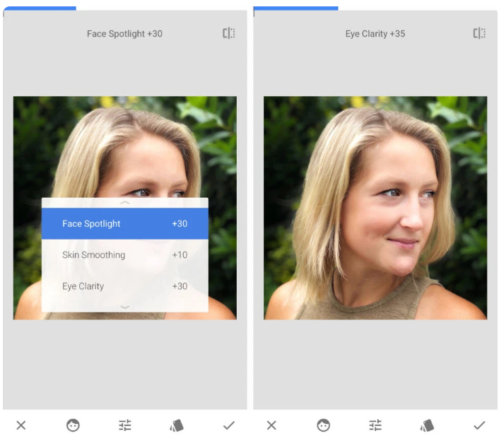

원근 보정 시 이미지 가장자리에 빈 공간(검은 영역)이 생길 수 있는데, Snapseed가 주변 픽셀로 자동 채워줍니다. 하늘·잔디·바다처럼 단순한 배경은 잘 채워지지만, 디테일이 많은 배경은 결과가 좋지 않을 수 있으니 확인 후 필요하면 되돌리거나 Crop으로 가장자리를 잘라내세요.

---

## 5. 사진 정리로 완벽한 편집 만들기

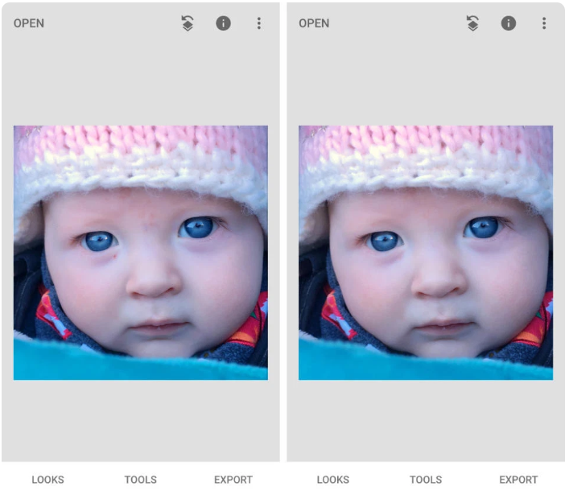

### 5.1 Healing (힐링/제거)
사진 속 불필요한 물체·잡티·오점을 제거하는 도구입니다. 제거할 대상 주변이 피부·하늘·바다처럼 단순한 배경일 때 가장 효과가 좋습니다. 

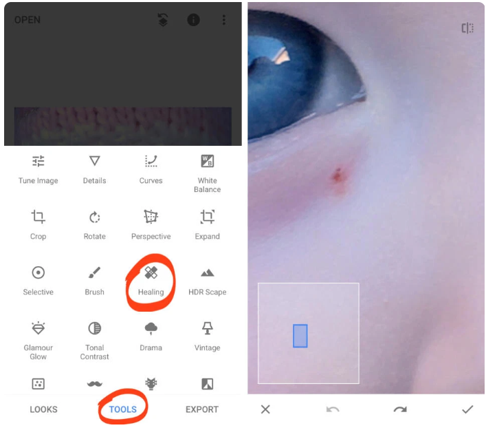

**Tools**에서 **Healing**을 탭하고, 두 손가락으로 확대해 제거하고 싶은 대상에 접근합니다. 

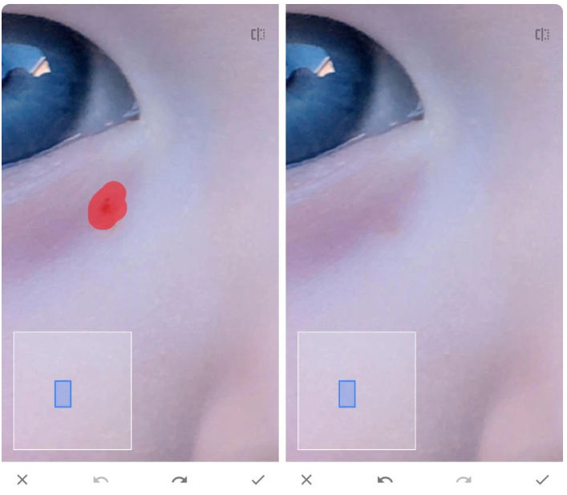

손가락으로 대상을 브러시하면 빨간색으로 표시되고, 손을 떼면 주변 픽셀로 자동 채워집니다. 

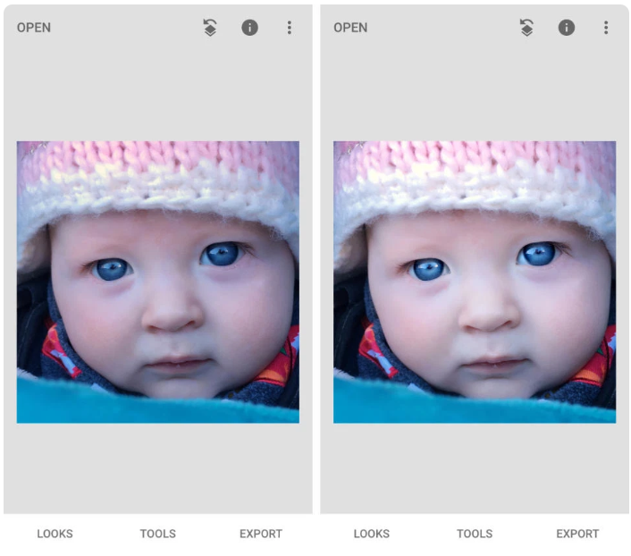

결과가 만족스럽지 않으면 하단의 **Undo**(되돌리기 화살표)를 탭하고 다시 시도합니다.

### 5.2 Portrait (인물 보정)
얼굴을 밝히고, 피부를 매끄럽게 하고, 눈을 또렷하게 만드는 인물 사진 전용 보정 도구입니다. 

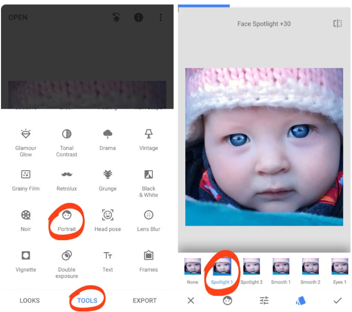

**Tools**에서 **Portrait**를 탭하고 이미지 하단의 프리셋(Spotlight 1, Smooth 1 등)을 선택합니다. 이는 편집의 출발점일 뿐이므로 처음엔 완벽하지 않아도 괜찮습니다. 

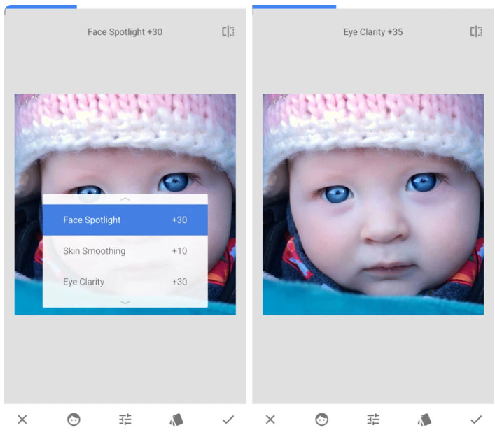

위아래로 스와이프해 세부 도구에 접근합니다:
- **Face Spotlight**: 인물의 얼굴을 밝게, 주변은 약간 어둡게
- **Skin Smoothing**: 피부를 매끄럽게
- **Eye Clarity**: 눈을 또렷하고 반짝이게

과도하게 적용하면 부자연스러워지므로 적당히 사용하세요.

---

## 6. 선택적 편집 도구 활용

사진의 각 부분을 따로 편집할 수 있는 강력한 도구들입니다.

### 6.1 Brush (브러시)
밝기와 색을 선택적으로 조정하는 도구로, 장면의 일부만 밝히거나 어둡게 하고 싶을 때 유용합니다. 예: 바위는 밝게, 구름은 어둡게, 일몰의 색은 더 선명하게. 

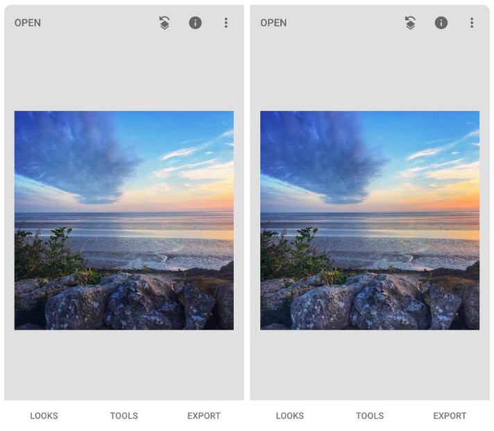

**Tools**에서 **Brush**를 탭합니다. 

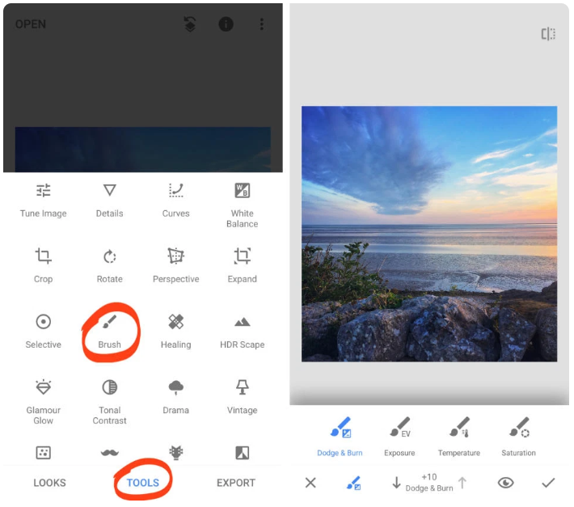

하단에 브러시 도구가 보이지 않으면 **Brush** 아이콘을 탭하세요. **Dodge & Burn** 브러시로 특정 영역을 밝게/어둡게 만들 수 있으며, 상하 화살표로 값을 조절합니다. 

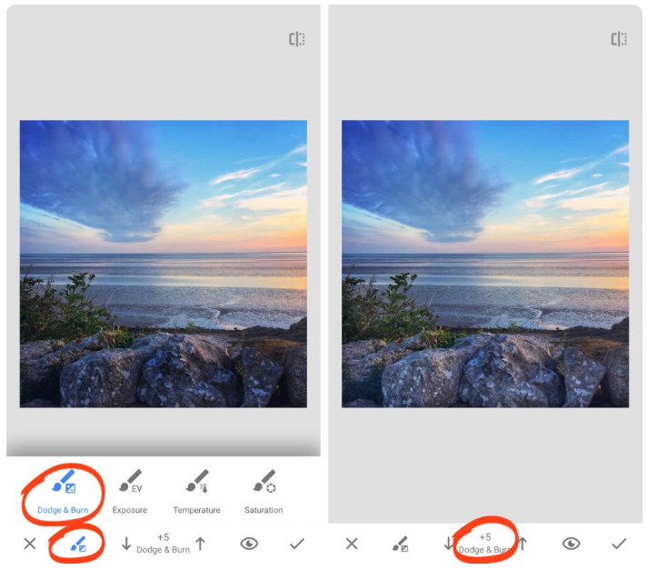

마이너스 값은 어둡게, 플러스 값은 밝게 만듭니다. 손가락으로 원하는 영역을 브러시하면 됩니다. 

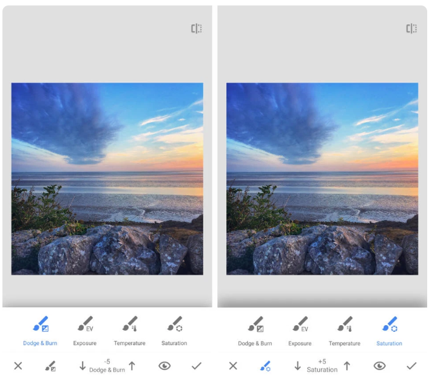

**Eye** 아이콘을 탭하면 브러시로 조정한 영역이 빨간색으로 표시됩니다. 

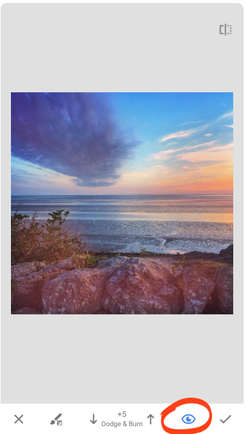

실수했다면 값을 **Eraser**로 설정한 뒤 빨간 영역을 다시 브러시해 지울 수 있습니다. 

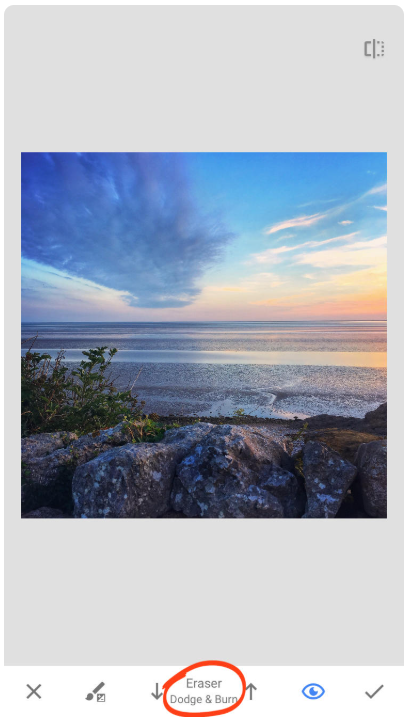

### 6.2 Selective (선택적 보정)
사진의 특정 색상 영역만 개별적으로 밝기·대비·채도·구조(Structure)를 조정하는 도구입니다.

**Tools**에서 **Selective**를 탭하고, 조정하고 싶은 색상 영역을 탭하면 조정점(작은 원)이 추가됩니다. 

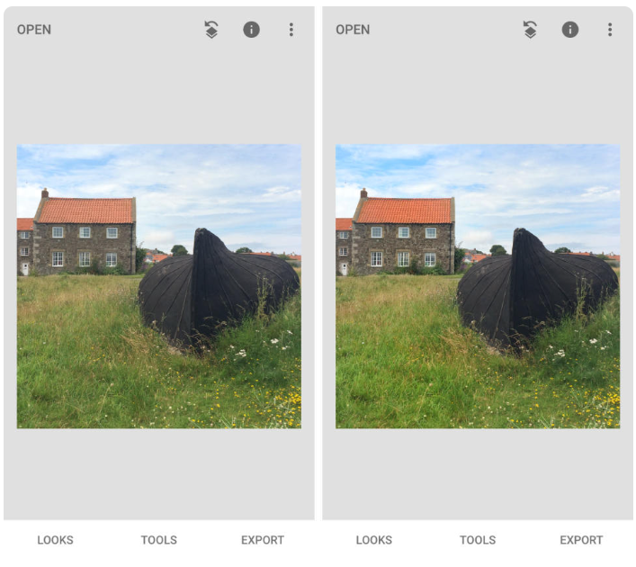

두 손가락으로 핀치하여 선택 범위를 조절하면, 영향을 받을 영역이 빨간색으로 표시됩니다. 

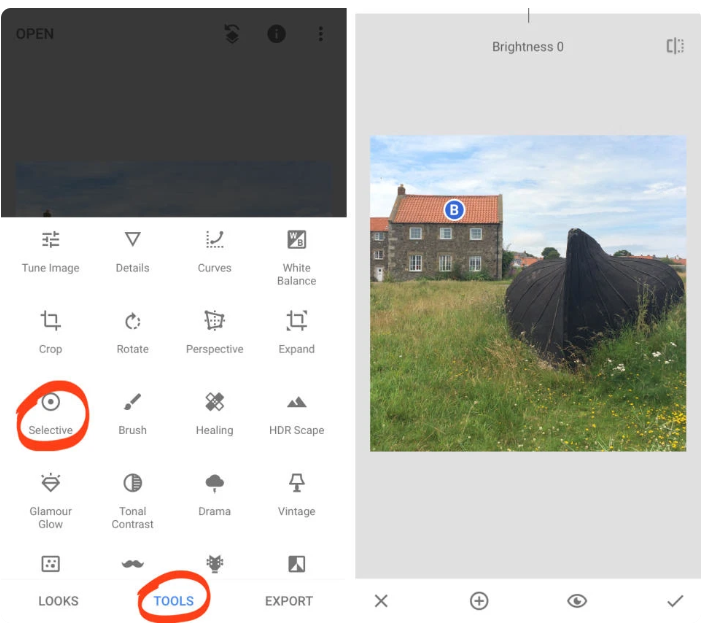

위아래로 스와이프해 네 가지 조정 도구(밝기·대비·채도·구조)에 접근하고, 좌우로 스와이프해 값을 조절합니다. 

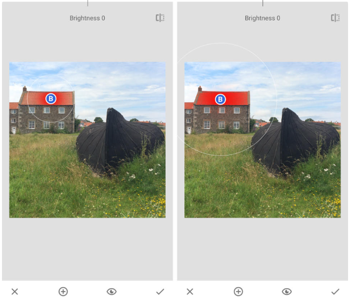

다른 색상 영역을 편집하려면 하단의 **+** 아이콘을 탭한 뒤 새 조정점을 추가하면 됩니다. 

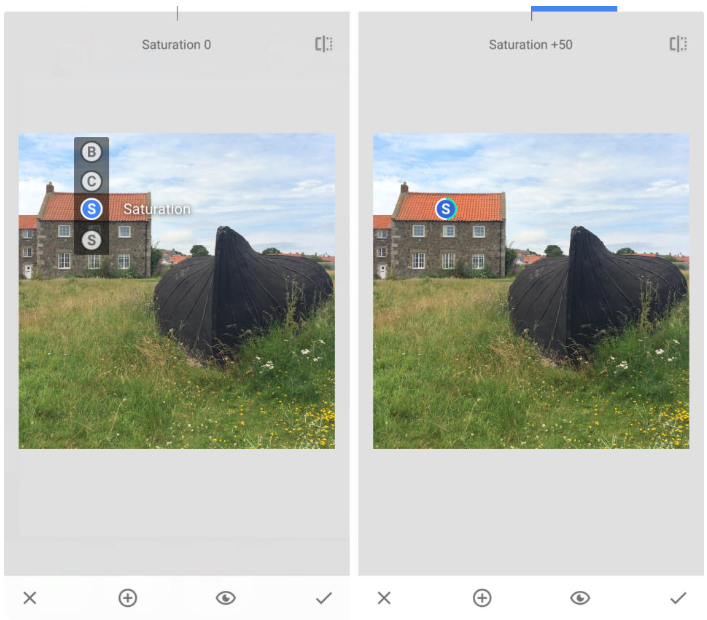

여러 개의 조정점을 추가할 수 있으며, **Eye** 아이콘으로 조정점 표시를 끄고 볼 수 있습니다. 완료되면 **체크마크**를 탭합니다. 

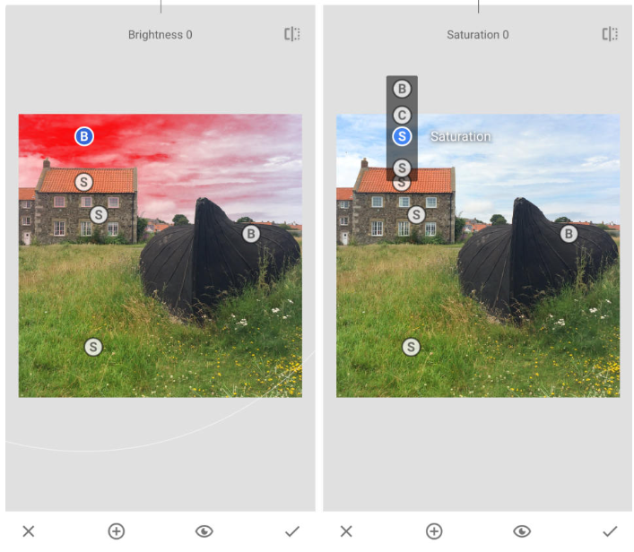

### 6.3 Masking (마스킹)
어떤 Snapseed 편집이든 선택적으로 적용할 수 있게 해주는 기능입니다. 예: 채도·밝기·색온도를 사진의 일부에만 적용하거나, 배경은 흑백으로 두고 주요 피사체만 컬러로 남길 수 있습니다. 

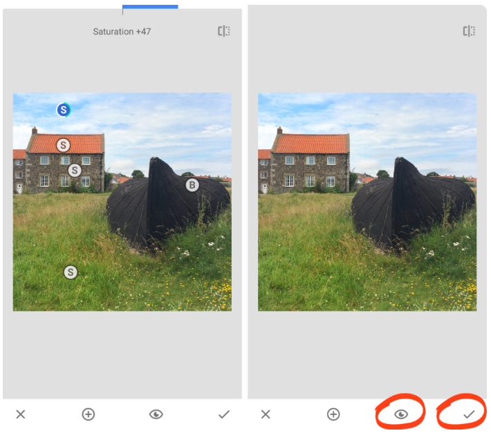

작동 방식: 먼저 편집을 전체 이미지에 적용한 뒤, Mask 도구로 그 편집을 선택적으로 적용합니다.

예시 – 흑백 + 포인트 컬러 만들기:
1. **Tools**에서 **Tune Image**를 선택하고 **Saturation**을 **-100**으로 설정한 뒤 **체크마크**. (전체 이미지가 흑백이 됩니다) 

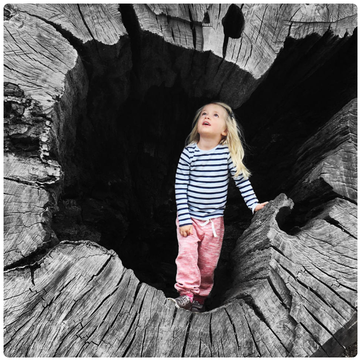
2. 상단 **Edit History** 아이콘을 탭하고 **View Edits** 선택. 

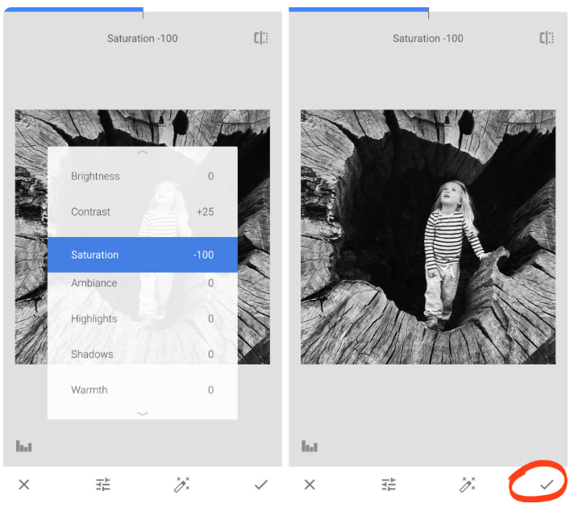
3. 편집 스택에서 **Tune Image**를 탭한 뒤 **Mask** 도구(브러시 아이콘)를 탭. 

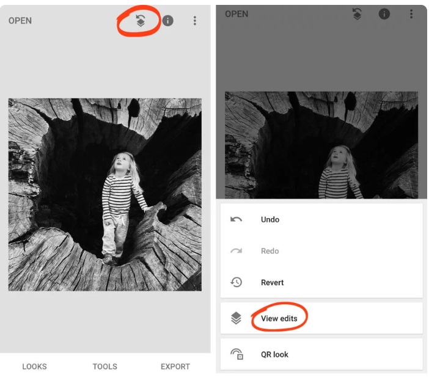
4. 마스킹 창에서 **Eye** 아이콘이 켜져 있는지 확인(선택한 영역이 빨간색으로 표시됨). 흑백으로 남기고 싶은 부분(예: 인물 제외한 배경)을 브러시합니다. 경계 부분은 확대해서 정교하게 선택하세요. 

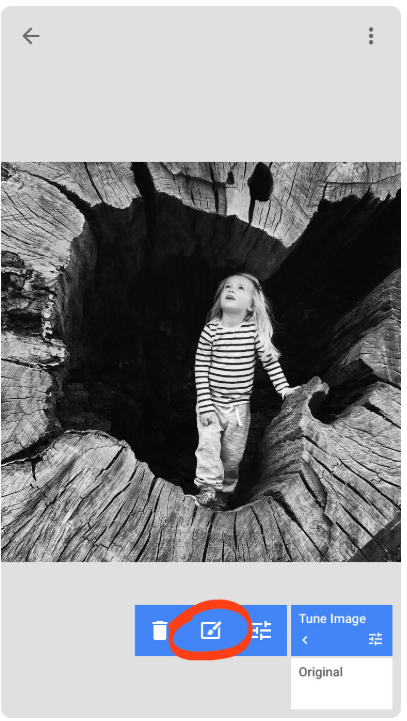
5. 실수했다면 값을 0으로 설정해 지우개처럼 지울 수 있습니다. 완료되면 **Eye** 아이콘을 꺼서 빨간 표시를 없애고, **체크마크**로 적용한 뒤 뒤로가기로 편집 기록 화면을 닫습니다. 

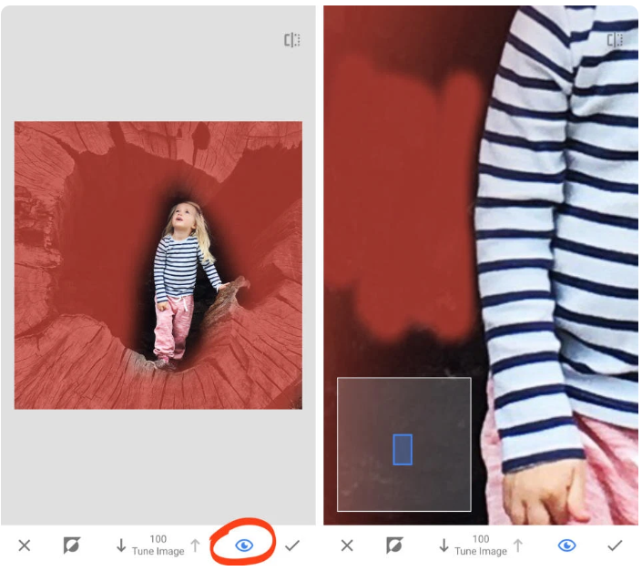

이 방식으로 어떤 편집이든 사진의 특정 부분에만 적용할 수 있습니다.

### 6.4 Vignette (비네트)
이미지의 안쪽 또는 바깥쪽을 은은하게 밝게/어둡게 만드는 도구로, 보통 가장자리를 어둡게 해 시선을 중심으로 모으는 데 사용합니다. 

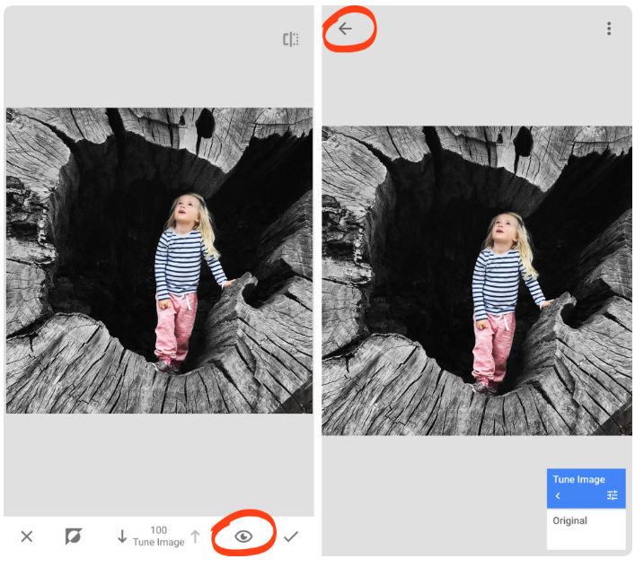

과하게 사용하면 사진을 망칠 수 있지만, 적절히 사용하면 주요 피사체로 시선을 유도하는 효과가 있습니다.

**Tools**에서 **Vignette**를 탭합니다. 

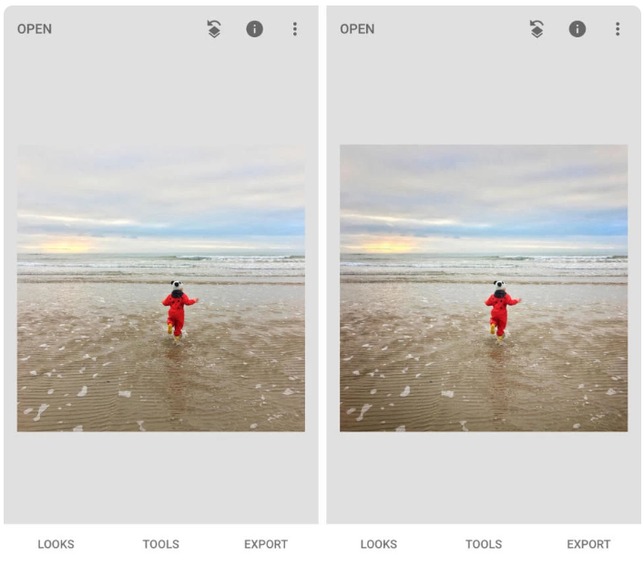

파란 원을 밝게 유지하고 싶은 영역으로 드래그하고, 두 손가락 핀치로 비네트 영역의 크기를 조절합니다. 

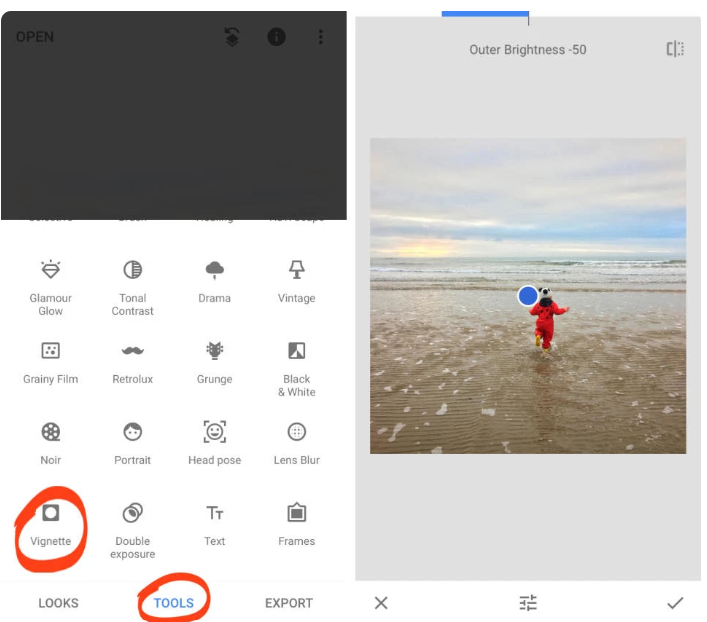

위아래로 스와이프해 **Outer Brightness(외부 밝기)** 와 **Inner Brightness(내부 밝기)** 를 조절합니다. 

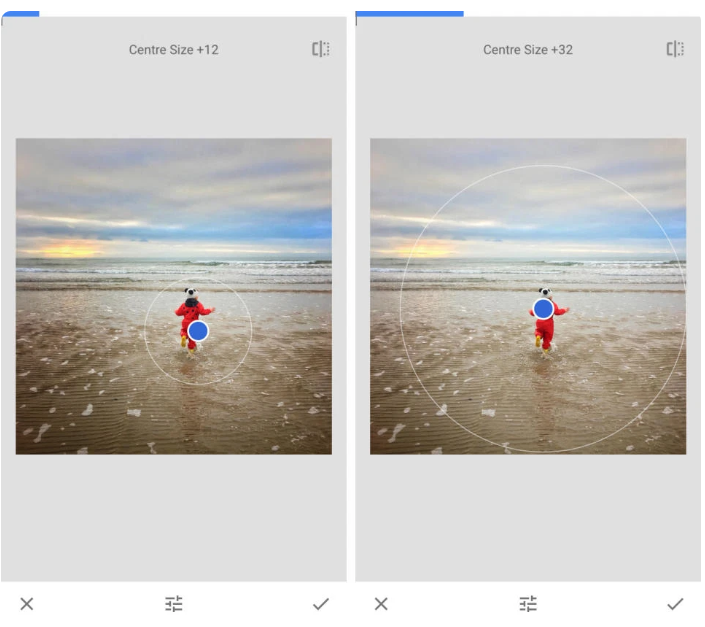

기본값은 Outer Brightness -50입니다. 마이너스는 어둡게, 플러스는 밝게 만듭니다. 

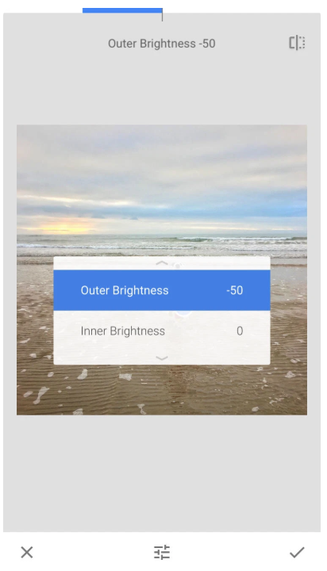

예: Inner Brightness를 +30으로 올려 중심(아이)을 밝히고, Outer Brightness를 -50으로 낮춰 가장자리를 어둡게 하면 시선이 중심으로 모이고 하늘도 더 극적으로 보입니다.

---

## 7. 필터로 분위기 바꾸기

Snapseed 필터는 한 번의 탭으로 사진의 느낌과 분위기를 빠르게 바꿔줍니다. 

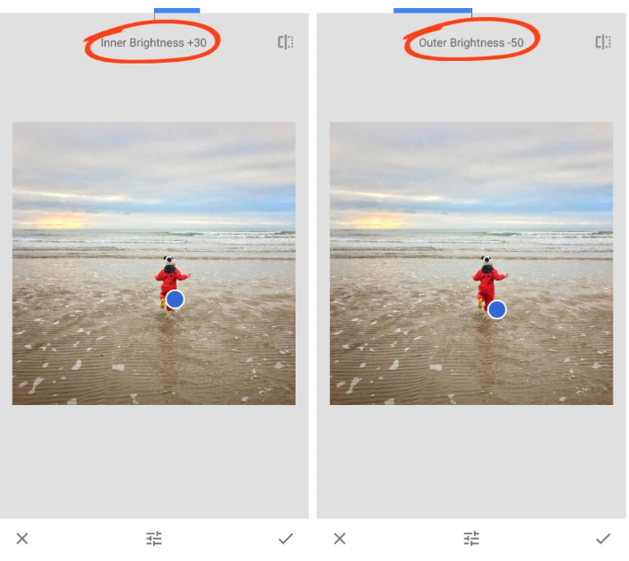

각 필터는 세부 조정이 가능합니다.

예: **Vintage** 필터 – **Tools**에서 **Vintage**를 탭합니다. 

사진 아래의 색상 그라데이션을 탭해 다양한 빈티지 필터를 시도해 보고, 위아래 스와이프로 세부 도구를 선택한 뒤 좌우 스와이프로 값을 조절해 커스터마이즈할 수 있습니다. 

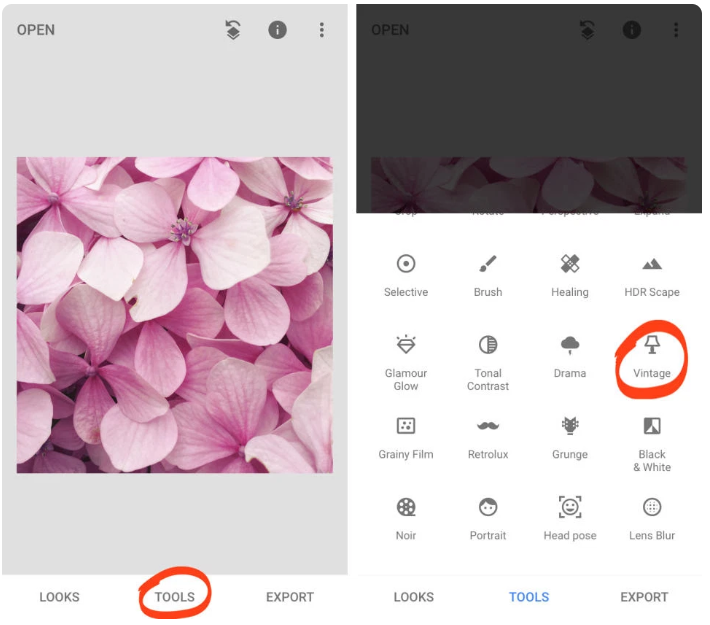

화면 하단의 **Blur** 아이콘으로 이미지 가장자리에 은은한 블러를 추가할 수 있습니다. 

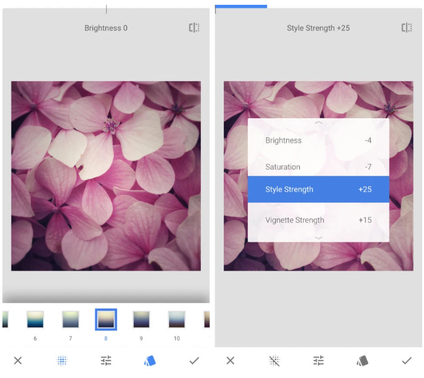

그 외 시도해볼 만한 필터 카테고리: **Black & White**, **Retrolux**, **Grunge**, **Noir**, **Glamor Glow**. 특히 **Grunge** 필터는 거친 질감을 더해주는데, 모든 사진에 적합하진 않지만 실험해보기에 좋습니다. 

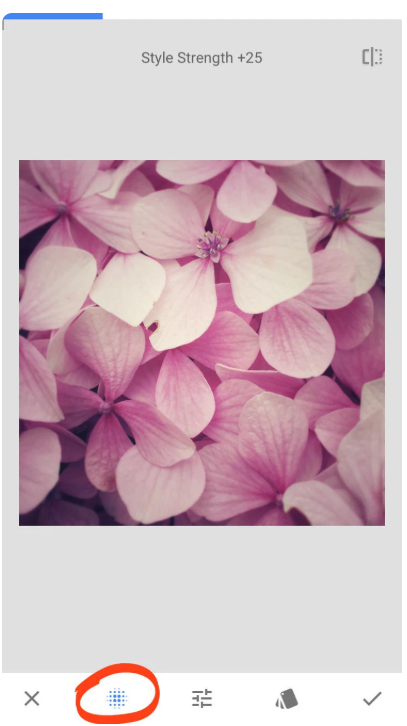

모든 필터는 비슷한 방식으로 동작합니다: 필터 선택 → 위아래 스와이프로 세부 설정 접근 → 하단 아이콘으로 추가 옵션 확인.

---

## 8. Looks로 편집 시작하기

**Looks**는 한 번의 탭으로 적용할 수 있는 미리 만들어진 편집 조합입니다. 어떻게 편집할지 모를 때 여러 Looks를 시도해보고, 이후 세부 조정을 하면 좋은 출발점이 됩니다. 자신만의 Look을 만들어 비슷한 스타일의 여러 사진에 반복 적용할 수도 있습니다.

### 8.1 Look 적용하기
화면 하단 **Looks**를 탭합니다. 

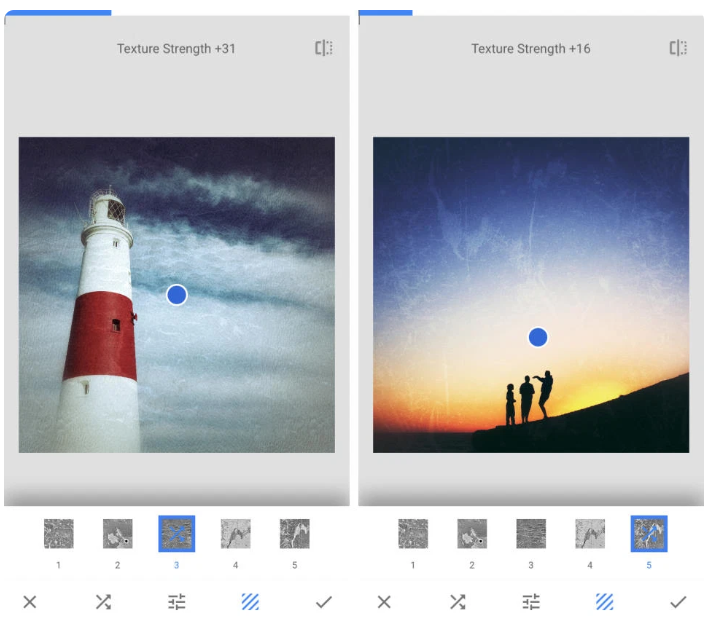

사진 아래에 나열된 여러 Looks를 탭해 어떻게 변하는지 확인합니다. 

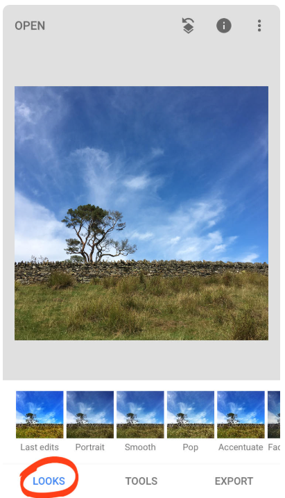

만족스러우면 **체크마크**, 취소하려면 **X**를 탭합니다. 또는 아래 방법으로 커스터마이즈할 수 있습니다.

### 8.2 Look 커스터마이즈하기
Look을 적용하고 체크마크를 탭합니다.

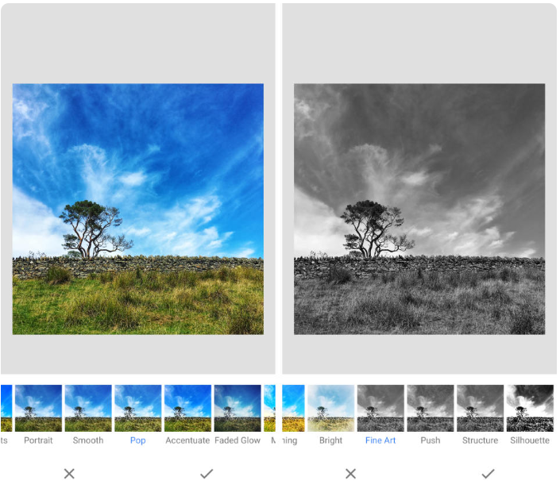

상단 **Edit History** 아이콘을 탭하고 **View Edits**를 선택합니다. 

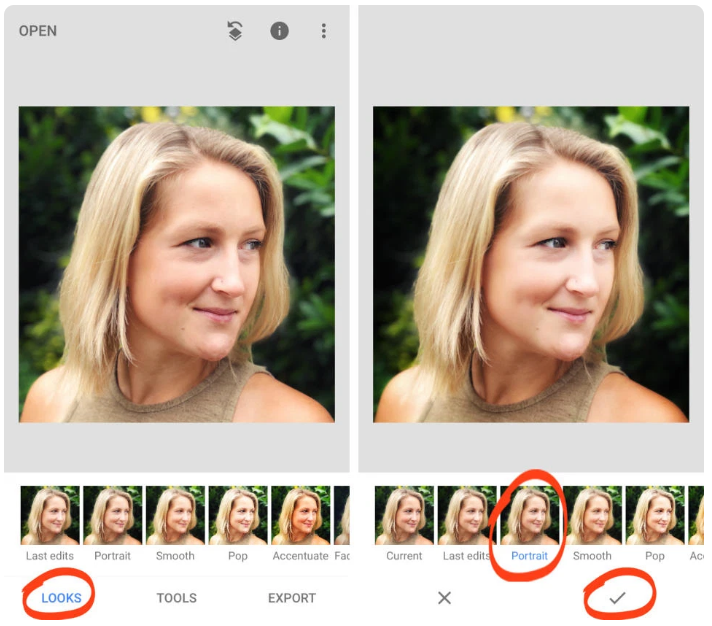

해당 Look을 구성하는 편집들이 화면 하단 스택에 나타납니다. 각 편집을 탭하면 더 많은 옵션이 나옵니다. 

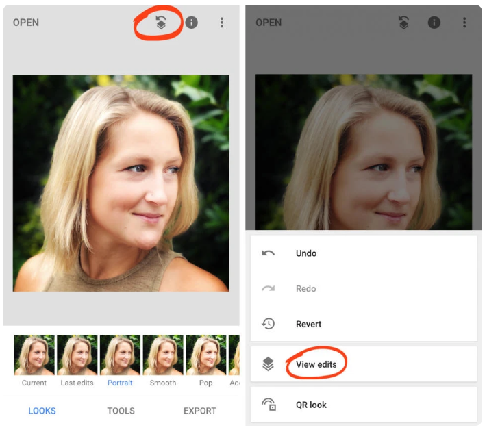

**Trash**로 편집 삭제, **Sliders**로 값 수정, **Brush**로 마스킹을 적용할 수 있습니다.

### 8.3 나만의 커스텀 Look 만들기
비슷한 편집을 여러 사진에 반복 적용하고 있다면, 자신만의 Look을 만들어 시간을 절약할 수 있습니다. 새로운 편집 아이디어를 실험하는 데도 좋습니다.

원하는 편집 도구 조합으로 사진을 편집한 뒤, 화면 하단 **Looks**를 탭합니다. Looks 목록을 맨 오른쪽까지 스와이프한 뒤 **Add Look(+)** 아이콘을 탭하고 이름을 입력한 뒤 **OK**를 탭합니다. 

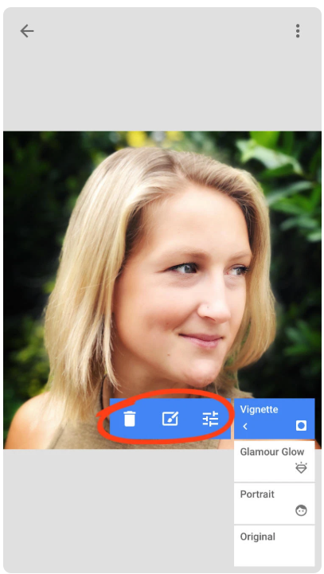

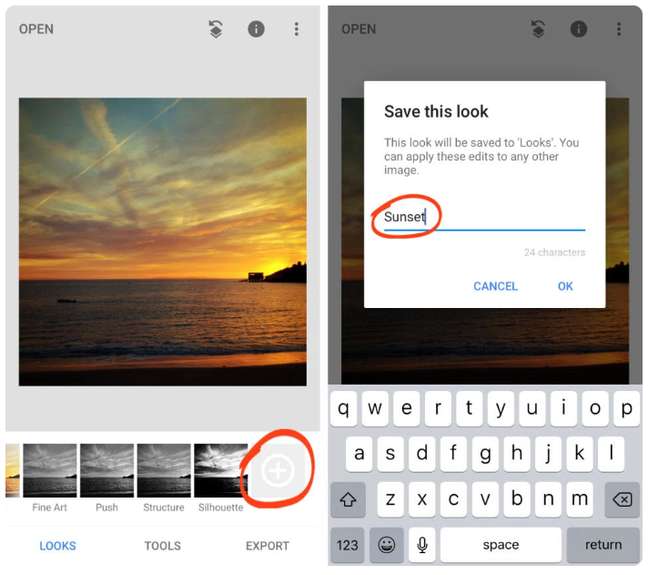

새로 만든 커스텀 Look이 하단 Looks 목록에 나타나며, 이후 비슷한 편집이 필요한 사진에 바로 적용할 수 있습니다. 

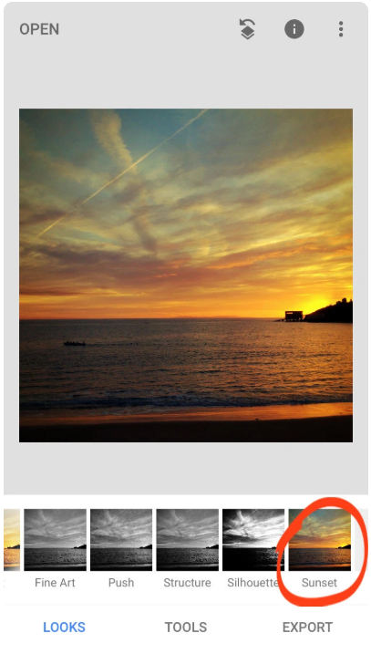

---

## 9. 편집한 사진 저장하기

편집이 끝나면 저장해야 합니다. 저장하면 핸드폰 기본 사진(갤러리) 앱에 저장됩니다.

화면 하단 **Export**를 탭하면 세 가지 저장 옵션이 나타납니다: **Save**, **Save A Copy**, **Export**. 

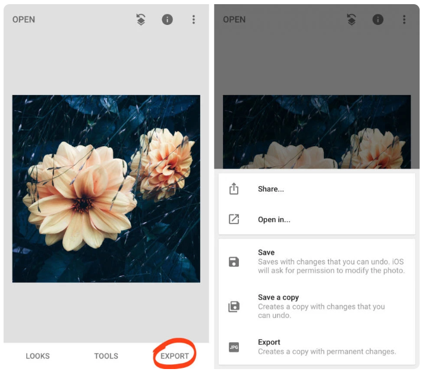

- **Save**: 원본 사진을 편집본으로 덮어씁니다(원본이 사라짐). 단, "비파괴 편집" 방식으로 저장되어 나중에도 편집을 수정/삭제할 수 있습니다.
- **Save A Copy**: 편집본을 별도 사진으로 저장합니다(원본과 편집본이 모두 남음). 이 역시 비파괴 편집으로 저장됩니다.
- **Export**: 편집본을 별도 사진으로, 영구적인 변경 상태로 저장합니다(이후 편집 취소·수정 불가).

**추천: Save A Copy** – 원본은 그대로 남기고, 편집본은 나중에도 수정 가능한 상태로 저장할 수 있어 가장 안전한 방법입니다.

---

*본 자료는 iPhone Photography School의 Snapseed 튜토리얼 내용을 한국어로 요약·재구성한 것입니다. 원문 및 영상 강의는 다음에서 확인할 수 있습니다: https://iphonephotographyschool.com/snapseed/*
